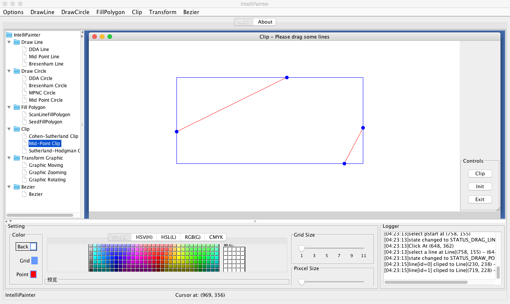

# IntelliPainter

## About
This is an old project exported from google code, demonstrating some graphic algorithms:

##### Drawing line
* DDA
* Mid-point
* Bresenham

##### Drawing circle
* DDA
* Bresenham
* MPNC
* Mid-point

##### Filling polygon
* Scan line
* Seed fill

##### Clipping
* Cohen-sutherland
* Mid-point
* Sutherland-Hodgman

##### Transforming
* Moving
* Zooming
* Rotating

##### Bezier
* Bezier

## Requirements
- jdk: 1.6
- groovy sdk: 1.7.4

## Screenshot

